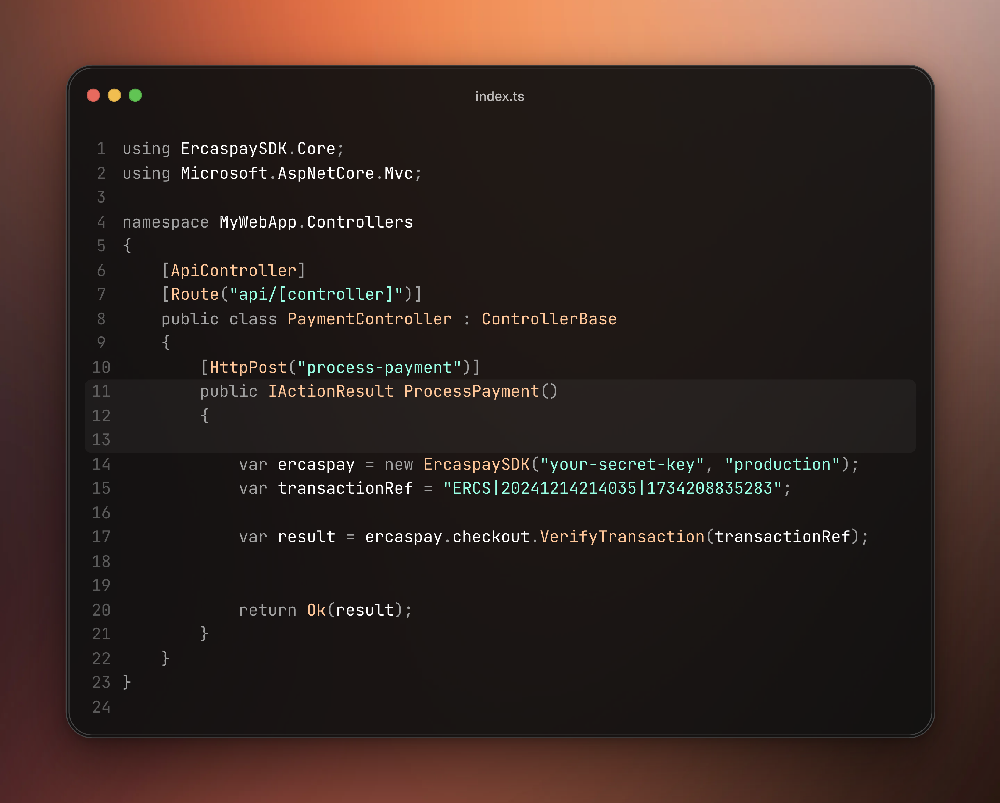
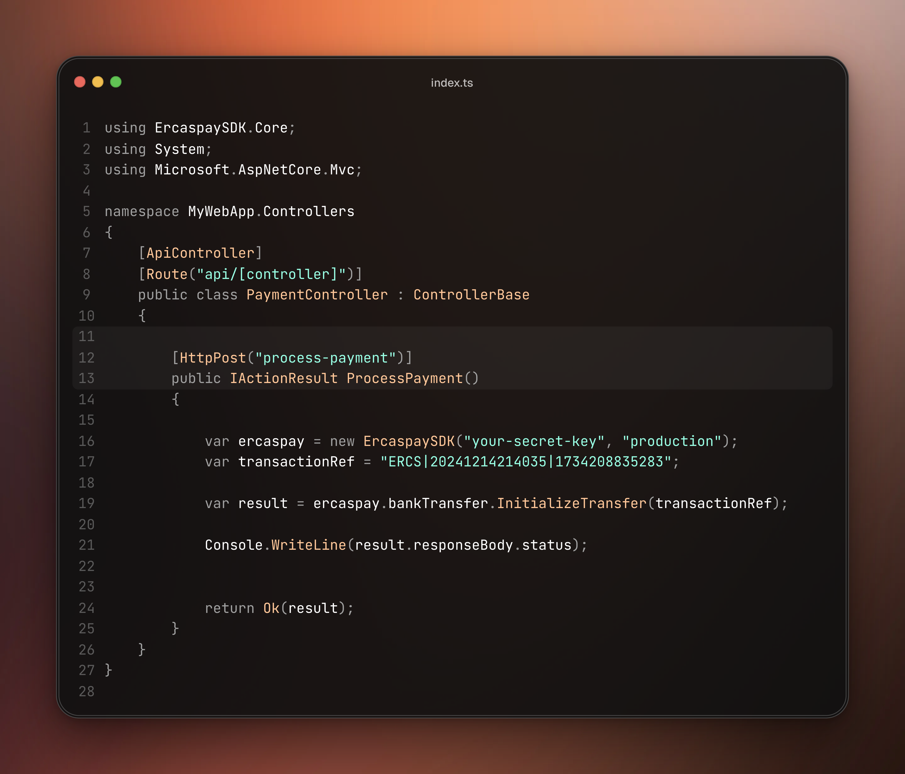

**Ercaspay Dotnet SDK**. Built with ❣️ by Team Godspeed

# Table Of Content
- [Table Of Content](#table-of-content)
    - [Introduction 🚀](#introduction-)
        - [Why Did We Build This? 🤔](#why-did-we-build-this-)
        - [Ercaspay Dotnet SDK Features 🚀](#ercaspay-dotnet-sdk-features-)
    - [Installation 💽](#installation-)

## Introduction 🚀

Introducing the **Ercaspay** Dotnet SDK: A Hackathon Innovation in Payment Solutions! 💡🏆

Built during an exciting hackathon sprint, our SDK is crafted on top of the powerful Ercaspay APIs to help developers easily integrate payment solutions into their apps. We’ve designed it to be intuitive, efficient, and super easy to use—no more complex setups or long implementation times. With our SDK, you’ll have everything you need to implement payments smoothly and get back to focusing on what matters most—building amazing products. 🚀

### Why Did We Build This? 🤔

During the hackathon, we saw a common challenge developers face: the complexity of integrating payment gateways. Having worked with payment APIs before, I know how frustrating it can be when there’s no SDK, leaving you to manually test the APIs with tools like Postman just to figure out what responses to expect. And even when an SDK exists, many don’t offer proper typing, making it a guessing game when calling methods or properties.

That’s why we built this SDK—to solve all of these problems. But we didn’t stop there. We went the extra mile to ensure it’s not just functional but robust and easy to use. We battle-tested our **SDK** with over **70** test suites to ensure reliability and performance under real-world conditions. We also added comprehensive documentation to each and every method and property, so users can start integrating right away—without having to read the docs. As you call a method or access a property, you’ll see all the details you need right in your **IDE**, making it easier than ever to integrate Ercaspay into your projects.


### Installation 💿
To install the SDK in your application, you can check the nuget gallery. <https://www.nuget.org/packages/ErcaspaySDK>. To install ino your projec, 

run 

```bash
dotnet add package ErcaspaySDK --version 1.0.0
```


### Examples



